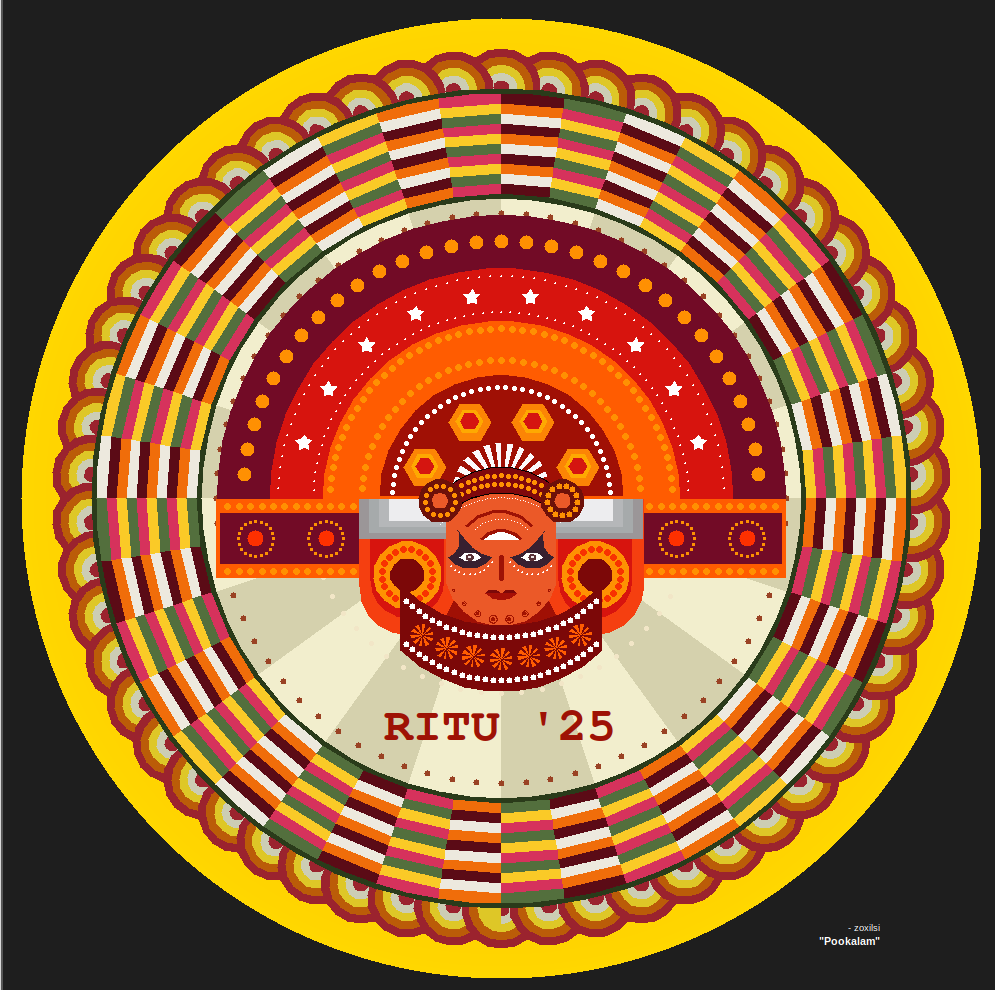

# 🌸 Code-a-Pookalam 2025 🌸
### *Create beautiful digital art through code this Onam season!*

---

## 🎨 About the Challenge

Welcome to **Code-a-Pookalam 2025** - a fun coding challenge organized by TinkerHub RIT! 

Pookalam is a traditional floral carpet made during the festival of Onam in Kerala. In this challenge, we're bringing this beautiful tradition into the digital world! Use your creativity and coding skills to create stunning digital Pookalams using any programming language of your choice.

Whether you're a beginner taking your first steps into programming or an experienced developer looking for a creative outlet, this challenge is for everyone! 🚀

---

## 🚀 How to Participate

Follow these simple steps to join the challenge:

### 1️⃣ Fork this Repository
Click the **Fork** button at the top right of this repository to create your own copy.

### 2️⃣ Clone Your Fork
```bash
git clone https://github.com/YOUR-USERNAME/Code-a-Pookalam-2025.git
cd Code-a-Pookalam-2025
```

### 3️⃣ Edit This README
Replace this template README with your own submission details using the format provided below.

### 4️⃣ Add Your Code
Create your Pookalam using any programming language! Popular choices include:
- 🐍 Python (with turtle, matplotlib, pygame)
- 🌐 HTML/CSS/JavaScript
- ☕ Java
- 🎯 Processing
- 🦀 Rust
- And many more!

### 5️⃣ Commit and Push to Your Fork
```bash
git add .
git commit -m "My Code-a-Pookalam 2025 submission"
git push origin main
```

### 6️⃣ Submit Your Repository
Share your forked repository link with the organizers by **September 6, 2025**!
- Email: [organizer-email@example.com]
- Discord: [Discord link/username]
- Or submit through [submission form link]

---

## 📋 Rules

1. **🍴 Fork Required**: You must fork this repository to participate
2. **✏️ Edit README**: Replace this README with your submission details
3. **💻 Any Language**: Use any programming language you're comfortable with
4. **🎨 Be Creative**: Let your imagination run wild with colors, patterns, and designs
5. **⏰ Deadline**: Submit your repository link by **September 6, 2025, 11:59 PM IST**
6. **🤝 Be Respectful**: Keep your code clean and family-friendly
7. **📸 Include Output**: Add screenshots or images of your Pookalam
8. **✅ Original Work**: Submit only your original code

---

## 📝 README Template for Your Submission

**Once you fork this repository, replace this entire README.md with the following format:**

```markdown
# 🌸 [Your Name]'s Pookalam 2025 🌸

## 👨‍💻 About Me
- **Name:** [Your Full Name]
- **Institution/Company:** [Your School/College/Company]
- **GitHub:** [@your-username](https://github.com/your-username)
- **Programming Language Used:** [Language]

## 🎨 My Pookalam

### Description
[Write a brief description of your Pookalam design, inspiration, or the approach you took]

### Preview

*Add more images if you have multiple views or animations*

### Features
- [Feature 1 - e.g., "Colorful geometric patterns"]
- [Feature 2 - e.g., "Animated flower petals"]
- [Feature 3 - e.g., "Interactive elements"]

## 🚀 How to Run

### Prerequisites
[List any requirements, libraries, or software needed]
```bash
# Example for Python
pip install matplotlib turtle numpy
```

### Running the Code
```bash
# Add your specific run commands here
python pookalam.py
# or
open index.html
# or your specific instructions
```

## 📁 File Structure
```
Code-a-Pookalam-2025/
├── README.md (this file)
├── pookalam.py (or your main file)
├── output/
│   ├── pookalam-preview.png
│   └── other-images.png
├── assets/ (optional)
│   └── any additional files
└── requirements.txt (if applicable)
```

## 🎯 Code Explanation

### Algorithm/Approach
[Briefly explain your approach - what shapes, patterns, colors you used]

### Challenges Faced
[Optional - mention any interesting problems you solved]

### What I Learned
[Optional - share your learning experience]

## 📸 Gallery
[Add multiple screenshots or GIFs if you have animations]

## 🎊 Happy Onam! 🎊
*Submitted for Code-a-Pookalam 2025 by TinkerHub RIT*
```

---

## 💡 Tips for Participants

- **Get Creative**: Think beyond traditional Pookalam patterns - add animations, interactivity, or 3D effects!
- **Document Well**: A good README makes your submission stand out
- **Include Visuals**: Screenshots, GIFs, or videos make your work more engaging
- **Share Your Process**: Explain your approach and what you learned
- **Test Your Code**: Make sure others can run your code with clear instructions

---

## 📚 Resources & Inspiration

### Programming Resources
- **Python Graphics**: Turtle, Matplotlib, Pygame, PIL
- **Web Technologies**: Canvas API, CSS Animations, SVG
- **Creative Coding**: Processing, p5.js, openFrameworks
- **Game Engines**: Unity (C#), Godot (GDScript)

### Pookalam Design Ideas
- Traditional geometric patterns
- Floral motifs and mandala designs
- Colorful concentric circles
- Interactive/animated elements
- 3D rendered Pookalams

---

## 🏢 Organizer Information

**Event Organized By:** TinkerHub RIT  
**Contact:** [Add contact information]  
**Event Date:** September 2025  
**Deadline:** September 6, 2025  
**Submission:** Email your repository link to [email]

### About TinkerHub RIT
TinkerHub RIT is a community of makers, learners, and innovators at Rajagiri Institute of Technology. We organize various tech events, workshops, and coding challenges to foster creativity and learning in technology.

---

## 🎊 Happy Coding & Happy Onam! 🎊

*May your code bloom as beautifully as a traditional Pookalam!*

---

**⭐ Don't forget to star this repository if you enjoyed the challenge!**

### 🔗 Share Your Work
After completing your submission, share it on social media with:
**#CodeAPookalam2025 #TinkerHubRIT #Onam2025 #CodingChallenge**
